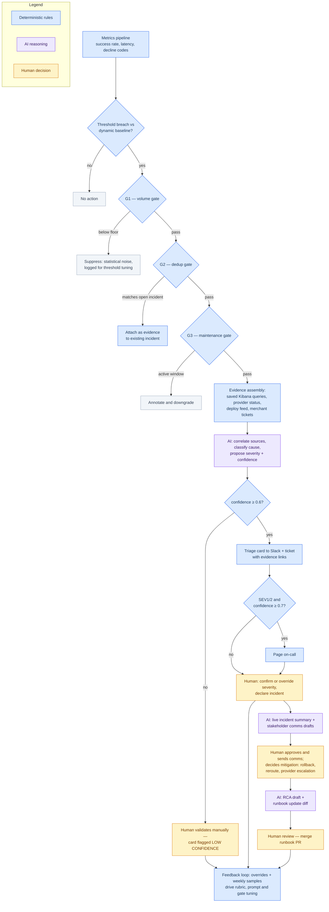

# APM Triage Agent — take-home package

*Tech Ops — APM team · AI & automation proposal · Dmytro · July 2026*

> **Automate the noise. Assist the judgment. Never touch the money.**

This repository accompanies my take-home proposal for the Technical Support
Engineer (APM) role: how AI and automation can improve the APM team's incident
operations — and, just as importantly, where they must not act. The centerpiece
is a **triage agent** designed end-to-end (trigger → gates → AI reasoning →
allowlisted actions → audit trail) and implemented here twice: as a runnable
Python prototype and as an interactive browser simulator.

## Try it in 30 seconds — no API key needed

```bash
python3 triage_agent.py --list
python3 triage_agent.py --scenario pix_provider_outage
```

Mock mode is the default: the reasoning layer is a transparent heuristic stub
with the same output contract as a real model, so the full pipeline runs
offline. With an `ANTHROPIC_API_KEY` set, `--live` switches Layer 2 to an
actual LLM (`pip install -r requirements.txt` first).

**Interactive simulator (same logic, in the browser):**
https://thenameisdmitry.github.io/apm-triage-agent-demo/ — or just open
`docs/index.html` locally.

## The design in one diagram

Rules where decisions are deterministic, AI where correlation and language
add value, humans wherever money or external parties are involved:



## What the prototype demonstrates

- **Gates run before any AI.** Three deterministic gates (volume, dedup,
  maintenance) stop roughly two thirds of noise — cheap, explainable, and no
  tokens spent. Only validated, enriched signals reach the model.
- **The AI verdict is always a proposal.** Paging happens only for SEV1/SEV2
  with confidence ≥ 0.7; low-confidence verdicts are flagged for human
  validation, and the agent is comfortable saying "unknown".
- **The agent has no write path to anything.** Its four actions are a fixed
  allowlist; in this demo they only print or append to local files. In
  production the same constraint lives at the IAM level, not in the prompt.
- **External text is untrusted.** Provider status pages and merchant tickets
  go into the prompt wrapped as `<untrusted_data>` — evidence to classify,
  never instructions to follow.
- **Every run is reconstructable.** An append-only JSONL decision trace
  (`traces/`) records inputs, gate results, the full prompt, the raw verdict,
  and every action taken or skipped.

## Scenarios

| Scenario | Path exercised |
|---|---|
| `pix_provider_outage` | full pipeline → provider_outage, SEV2, page on-call |
| `ideal_release_regression` | full pipeline → our_release (deploy correlation) |
| `sofort_low_volume` | stopped at G1 — statistical noise, no AI invoked |
| `klarna_duplicate` | stopped at G2 — attached to open incident INC-2041 |
| `pix_maintenance` | stopped at G3 — scheduled maintenance window |
| `wallet_unknown` | full pipeline → unknown cause, low confidence, no page |

## Repository layout

```
triage_agent.py       the prototype: gates → reasoning → allowlisted actions → trace
scenarios/            six synthetic alerts, one per pipeline branch
docs/index.html       interactive simulator (GitHub Pages serves this folder)
diagrams/             end-to-end automation flow (Mermaid source)
proposal/             written design: problem framing, use cases, agent deep-dive
requirements.txt      one optional dependency, used only by --live
```

The full proposal deck (problem framing, three use cases, agent design,
guardrails, KPI framework, staged rollout) is submitted alongside this repo.

---

*This package was itself built AI-assisted — the same working style it
proposes for the team.*
