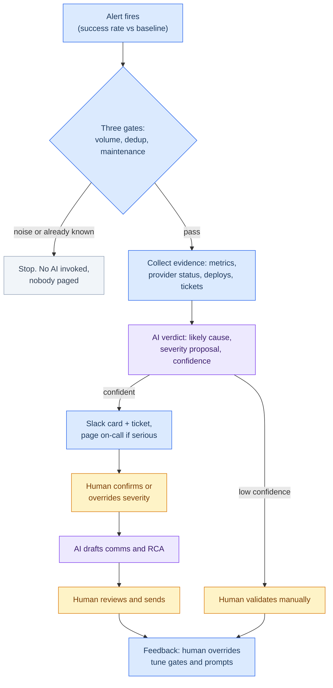

# Unlimit home task: APM Triage Agent

*The task is for the position of Tech Ops, APM team · AI and automation proposal · Dmitrii Zhukov · 13 July 2026*

## Introduction

When a payment method starts failing, an on-call engineer spends 10-15 minutes
answering three questions: is the alert real, how bad is it, and who should be
involved? This repository contains a prototype of an AI agent that answers
those questions in seconds, while a human keeps every decision that matters.
It accompanies my take-home proposal for the Technical Support Engineer (APM)
role.

**The rule behind the design:** cheap deterministic checks run first, AI gives reasons
only for over validated signals, and nothing automated ever touches live payment
traffic.

## Three scenarios to try

**1. Pix, provider outage.** Friday evening in Brazil: Pix success rate falls
from 91% to 63%, merchants open tickets. The agent passes the gates, matches
the drop with the provider's degraded status page, proposes SEV2 with
confidence 0.85, and pages the on-call engineer.

**2. Sofort, 3 a.m. blip.** The success rate looks terrible, but there were
only 14 payments in the last hour. Percentages mean nothing on numbers this
small. The volume gate stops the alert before any AI is invoked: no tokens
spent, nobody woken up.

**3. GCash, unclear dip.** Metrics moved, but nothing corroborates it, and
the provider status page is 55 minutes stale. The agent honestly says
"unknown", lowers its confidence to 0.3, flags the card for human validation,
and does not page anyone. An agent that can say "I don't know" is an agent
you can trust.

## Run it (30 seconds, no API key)

```bash
python3 triage_agent.py --scenario pix_provider_outage
```

You will see the gates evaluated one by one, then a triage card like this:

```
[G1_volume] PASS: 4180 txn/h vs. minimum 100
[G2_dedup] PASS: no matching open incident
[G3_maintenance] PASS: no active maintenance window

+----------------------------- TRIAGE CARD ------------------------------+
| Verdict   : provider_outage   Severity proposal: SEV2   Confidence: 0.85
| Reasoning : Provider reports 'degraded_performance' while success rate
|             dropped 28% vs. 7-day baseline...
| NOTE      : severity is a PROPOSAL: on-call confirms or overrides.
+-------------------------------------------------------------------------+
>>> PAGING ON-CALL: proposed SEV2, confidence 0.85
```

Every run also writes an append-only decision trace to `traces/`: inputs,
gate results, the full prompt, the raw verdict, and every action taken or
skipped. Mock mode is the default; with an `ANTHROPIC_API_KEY` set, `--live`
switches the reasoning layer to a real model
(`pip install -r requirements.txt` first).

## Interactive simulator

Same three scenarios and the same logic, animated in the browser:

**https://thenameisdmitry.github.io/apm-triage-agent-demo/**

Or open `docs/index.html` locally. Each scenario starts with a short plain
description of the situation, then you watch the alert travel the pipeline
and the decision trace fill in below.

## The flow in one picture

Blue is deterministic rules, purple is AI, amber is a human:



## What keeps it safe

- The agent reads six data sources and can write to none of them. Its four
  allowed actions (Slack card, ticket, conditional page, attach evidence)
  are a fixed allowlist enforced in code and IAM, not in the prompt.
- Severity is always a proposal; a human confirms or overrides it.
- Text from merchants and provider pages goes into the prompt wrapped as
  untrusted data: evidence to classify, never instructions to follow.
- One environment flag turns the agent off and returns the team to fully
  manual triage.

## Repository layout

```
triage_agent.py       the prototype: gates → reasoning → allowlisted actions → trace
scenarios/            three synthetic alerts, one per outcome
docs/index.html       interactive simulator (served by GitHub Pages)
diagrams/             the flow diagram above (Mermaid source)
proposal/             written design notes: framing, use cases, agent deep-dive
requirements.txt      one optional dependency, used only by --live
```

The full proposal deck (problem framing, three use cases, agent design,
guardrails, KPIs, staged rollout) is submitted alongside this repo.

---

*Built AI-assisted, which is the same working style this proposal suggests
for the team.*
